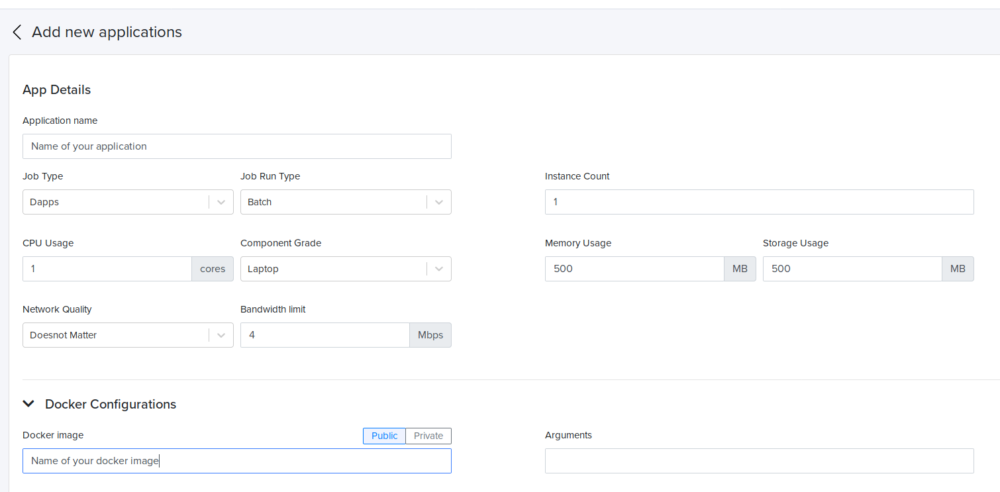
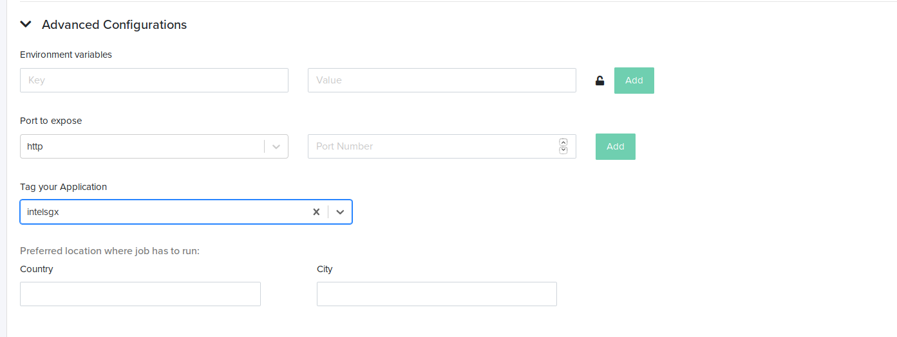
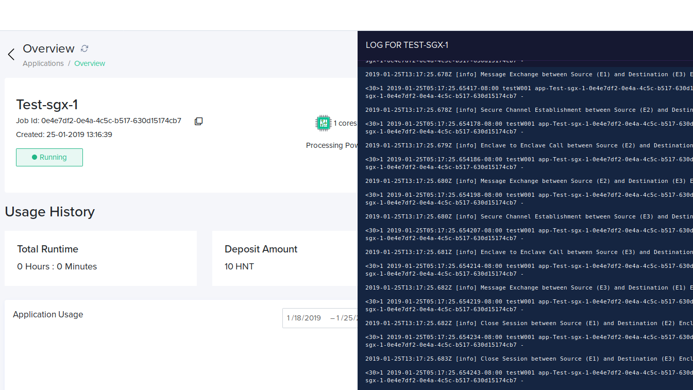

Deploying Intel SGX Applications
=========================================

Deploying Intel SGX application consists of two steps. 

1. Writing an SGX app 
2. Deploying them on Huron

Prerequisites:
--------------

Your CPU should support Intel SGX & Intel SGX should be enabled in the bios 
Boot your Intel machine and in the bios setting, click on "Intel Software guard extensions" and then on the right pane, select "Enabled"
Exit Bios and wait for system to boot
If your CPU does not support, you can still develop applications and test them in simulation mode. However, you wouldn't be able create Enclaves and applications won’t run on hardware mode on your machine ( This is the mode where enclaves actually get created and applications run on them)

SGX APP
-------

If you are a windows user, please install `Virtualbox`_ and create an ubuntu Virtual machine. Follow this `youtube`_ video  to create a ubuntu virtualbox on Windows.

.. _Virtualbox: https://www.virtualbox.org/wiki/Downloads  

.. _youtube: https://www.youtube.com/watch?v=RBU1xMP-SGc

Once you have Ubuntu setup, install Intel SGX SDK for Linux. (https://github.com/intel/linux-sgx) 

Sample Code
----------- 
https://github.com/digawp/hello-enclave.

This has a sample SGX application which generates a random number. 
This is a simple app which has a trusted function for generating a random number and seals and unseals the data. More information on sealing can be found here

This App.cpp program consists of the main function which is responsible for initializing, creating enclaves and running trusted code on them. The utility functions ( initialize & creation of enclaves) can be found in sgx_utils.cpp 
 
Then, there is the Enclave directory with the following contents.

Enclave.edl -- This is the enclave definitive language file where you define the ECALLS and OCALLS function

Ecalls are the function which are the entry points to the enclave from untrusted applications and likewise, Ocalls are the function which calls the untrusted functions from the enclaves.
The signatures of these functions are written in Enclave.edl file

Enclave.cpp -- This has the definition of the ECALLS and OCALLS.

Enclave.config.xml -- This contains the user-defined parameters for the enclave. This is required for signing the enclave.

Enclave_private.pem -- The private key needed for signing the enclave. 
This can be generated by the following command 

.. code-block:: python

   openssl genrsa -3 -out enclave-key.pem 3072

Sealing -- This contains the edl & function definitions for sealing the enclave data

You can write your own functions in Enclave.cpp and define their signature in Enclave.edl 

You can compile the app using the following command 

.. code-block:: python

   make SGX_PRERELEASE=1  SGX_MODE=SIM
   
This creates an app in simulation mode. 

If you encounter an error like this "/usr/bin/ld: cannot find -lsgx_tstdcxx", Open the makefile and find and remove this "-lsgx_tstdcxx". Save and do a make again. 
You can run the application by running ./app ( Please note that this is a simulation mode, where enclaves are not created in your machine) 

Deploying App on DeepCloud AI Platform
---------------------------------------

If the app works as expected on simulation mode, you can do a "make clean" and build the app again using hardware mode. 

.. code-block:: python

   make SGX_PRERELEASE=1  SGX_MODE=HW.

If your machine does not have SGX support, running, "./app" would throw an error like "SGX error code: 8198
Fail to initialize enclave" 

For deploying your app on DeepCloud AI, you would need to install Docker. Here is a sample Dockerfile which you can use for creating a docker image for your sgx app. Please do a "make clean" before creating a docker image.

FROM sebvaucher/sgx-base:sgx_2.4
COPY . ./
RUN make SGX_DEBUG=0 SGX_PRERELEASE=1 SGX_MODE=HW
CMD ["./app"]

Save these 4 lines in a Dockerfile and place it in the path where your app binary resides. 

Then build a docker image using

.. code-block:: python

   docker build -t <your image name> .

Once the image has been created, push it to your dockerhub account.

.. code-block:: python

   docker push <your image name>

Once the docker image is ready, its time to run the application.

- Go ahead and create an application, fill out the forms like shown in the image below.

- To Ensure that your application runs on an Intel SGX machine, click on advance configuration, and in "Tag your application" dropdown, choose "intelsgx". If you do not see that, start typing "intelsgx" on the box and you would be able to see it. Select "intelsgx" and click Save Application.

- After saving your application, you’d be redirected to payment screen. Then click Unlock to initiate payment. 
  Please wait for sometime for your payment to get completed. 

Application Logs
^^^^^^^^^^^^^^^^^

Once it is complete, your app would start running on an SGX machines. You would be able to view the logs by clicking on the logs button on the right side .

