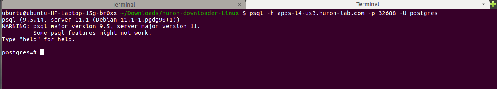
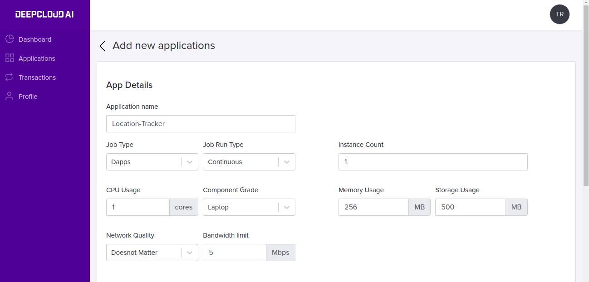
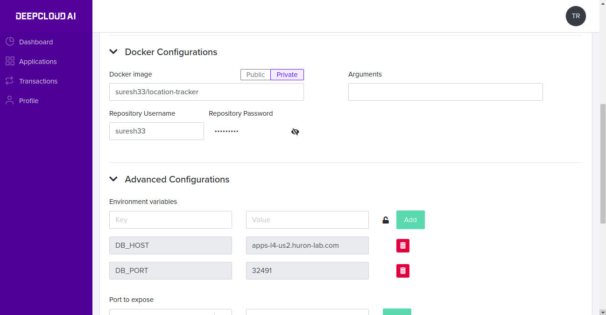
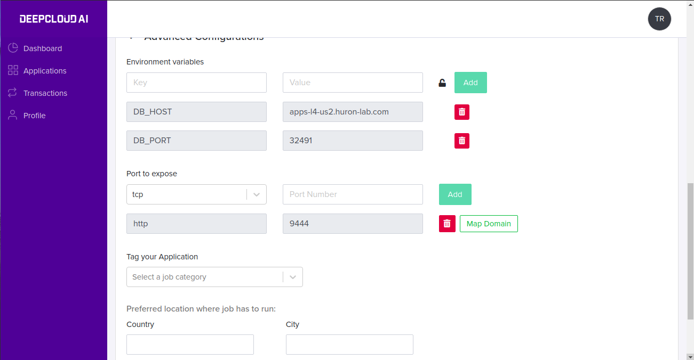
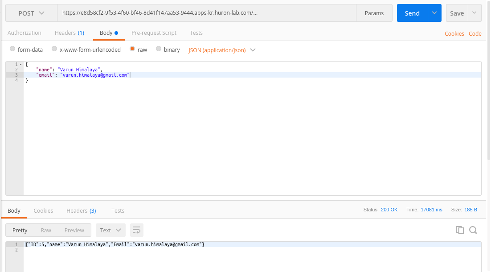
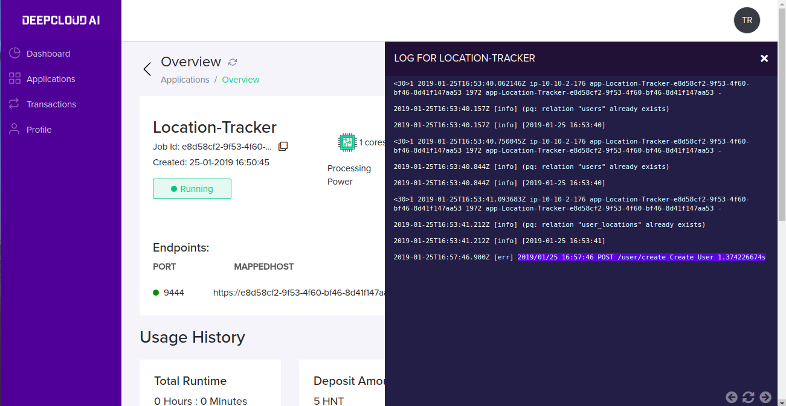

Sample Applications
===========================

Running Postgres and connecting it
--------------------------------------

- Log in with an Application Developer account
- Click on Add new application, and fill in the fields with the following details.

    * Application Name - Postgres
    * Job Type - Dapps
    * Job Run Type - Continuous
    * Instance Count - 1 (by default)
    * CPU Usage - 1 Core
    * Component Grade - Laptop
    * Memory Usage - 512 MB
    * Storage Usage - 512 MB
    * Network Quality - Medium
    * Bandwidth limit - 10

- Under Docker Configurations, fill in the docker image name as postgres 

    *  Docker image - Postgres (Enter your public docker image)    

  .. image:: ./_static/images/p_image2.png

- Under Advanced Configurations, fill in the fields with the below details

    * Port to expose - 5432
    * Country - USA
    * City - Santa Clara

  .. image:: ./_static/images/p_image1.png

- Now click on Save Application, and complete the Payment

  .. image:: ./_static/images/p_image6.png

- After payment, The application will start running and endpoints URL and port will be displayed (apps-l4-us3.huron-lab.com:32688)

  .. image:: ./_static/images/p_image3.png

- Click on logs button to check the logs for running application

  .. image:: ./_static/images/p_image4.png

- That's it! Postgres database is up and running in Huron. Let's connect the Postgres Database from the local system.

- Enter the endpoint URL and port in host and port

.. code-block:: python

   psql -h apps-l4-us3.huron-lab.com -p 32688 -U postgres

Deploying REST API in Huron
--------------------------------------

Location Tracker is a REST API, which stores and retrieve user’s check-in location from PostgreSQL DB. This guide also explains how to provide private docker repository images.

- Create a Postgres application in Huron with the above steps

- Add a new application with the following details.

    * Application Name: Location-Tracker
    * CPU Usage: 1
    * Memory Usage: 256
    * Storage Usage: 500
    * Bandwidth limit: 5
    * Docker Configuration
    * Docker image: suresh33/location-tracker
    * Repository type: private
    * Repository Username: suresh33**
    * Repository Password: ********
    * Advanced Configuration
    * Port to expose:
      http  - 9444

- Once the REST API is started running we get endpoints which is used to make rest calls,

- Testing Location Tracker through Postman

